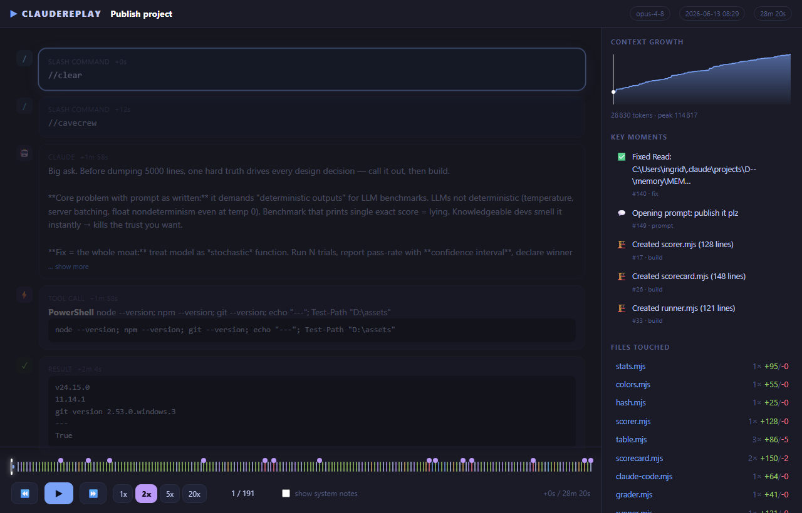
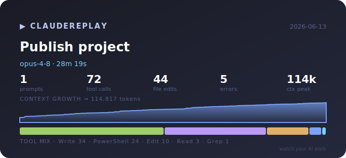
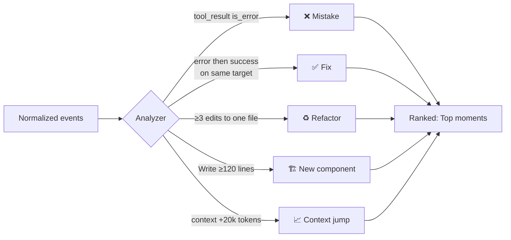
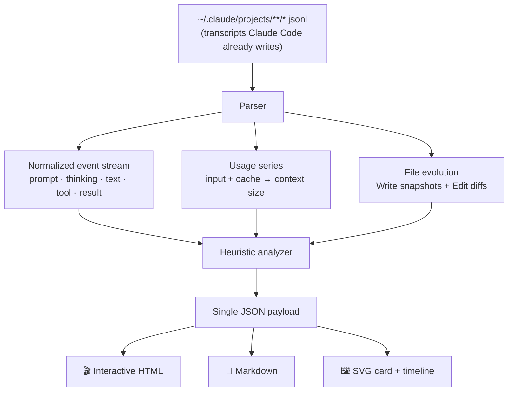

<div align="center">

# ▶ ClaudeReplay

### **Watch your AI work.**

Replay any [Claude Code](https://claude.com/claude-code) session like a movie — every prompt, every thought, every tool call, every file edit, every command, scrubbable on a timeline.

[](#tested)
[](#install)
[](#why-its-different)
[](#privacy)
[](LICENSE)

<br>



<sub>A real session — "Publish project", 192 events, 28 minutes — replayed in the browser. Press ▶ and watch it happen.</sub>

</div>

```bash
# zero install — just Python
python claudereplay.py open last      # build + open the most recent session as a movie
```

---

## The problem

A Claude Code session is one of the most information-dense artifacts you will ever produce. In thirty minutes Claude reads a dozen files, forms a hypothesis, tries a fix, hits an error, backs out, tries again, and ships. **Then the terminal scrolls away and all of it is gone.**

<table>
<tr>
<th width="50%">😶 Without ClaudeReplay</th>
<th width="50%">▶ With ClaudeReplay</th>
</tr>
<tr>
<td valign="top">

- *"How did it actually fix that bug?"* — no idea
- *"When did the regression sneak in?"* — gone
- *"Which file did it change first?"* — lost
- *"Why that implementation?"* — the reasoning vanished
- The session is a wall of scrollback you'll never reopen
- New teammates can't learn from how you work with AI

</td>
<td valign="top">

- **Replay** the whole session step by step, like a recording
- **Scrub** to any moment; jump straight to the fix or the mistake
- **See context grow** from 10k → 200k tokens as it happens
- **Read the reasoning** that led to each decision
- **Diff every file** the moment it changed
- **Share** a single self-contained HTML file — no server, no account

</td>
</tr>
</table>

---

## 30 seconds to your first replay

```bash
git clone https://github.com/ingridtoulotte/claudereplay
cd claudereplay

python claudereplay.py list          # see every session on this machine
python claudereplay.py open 0        # build + open #0 as an interactive movie
```

No pip install, no dependencies, no config. ClaudeReplay reads the session
transcripts Claude Code already writes to `~/.claude/projects/` and turns them
into something you can watch.

---

## What you get

ClaudeReplay reconstructs a session into a normalized, timestamped event stream,
then renders it four ways:

| Output | Command | What it's for |
|---|---|---|
| 🎬 **Interactive HTML replay** | `build` / `open` | The movie. One portable file. Scrub, play, 1×–20×, jump to moments. |
| 📝 **Markdown summary** | `summary` | A report for the PR description or your notes. |
| 🖼️ **SVG session card** | `card` | A screenshot-worthy social card. |
| 📊 **SVG timeline** | `timeline` | A GitHub-friendly strip you can drop in a README. |

### The session card



> One glance: model, duration, prompts, tool calls, file edits, errors, the
> context-growth curve, and the tool mix. `python claudereplay.py card 0`.

---

## The replay experience

Press **▶** and the session plays back at the pace it actually happened
(time-compressed and clamped, so a 4-hour session is watchable in minutes):

- **💬 Your prompt** appears, then
- **💭 Claude's reasoning** (the actual `thinking` blocks), then
- **🤖 the response**, then
- **⚡ the tool call** — `Read`, `Edit`, `Write`, `Bash`/`PowerShell`, `Grep`… with its arguments, then
- **✓ / ✖ the result** — success or error, inline.

While it plays, the right rail stays live:

| Panel | Shows |
|---|---|
| **Context growth** | A filling area chart with a playhead — watch the window climb toward its peak, and *feel* the large reads that spike it. |
| **Key moments** | Auto-detected fixes, mistakes, refactors, file creations, context jumps. Click to jump. |
| **Files touched** | Every file with `+adds/-dels`. Click for a full per-version **diff viewer**. |
| **Tool mix** | A color-coded bar of how the time was spent. |

**Controls:** `space` play/pause · `←/→` step · `↑/↓` speed · `Home/End` jump ·
click the scrubber to seek · click a ◆ marker to leap to a key moment.

The colored ticks on the scrubber *are* the tool-usage timeline — blue reads,
green writes, amber edits, purple commands, red errors — so the shape of the
whole session is visible before you press play.

---

## Session intelligence

ClaudeReplay doesn't just render — it *reads* the session and flags what mattered.
These are transparent heuristics (no LLM call, no network), labelled as such:



| Signal | How it's detected |
|---|---|
| **❌ Mistake** | a `tool_result` came back with `is_error` |
| **✅ Fix** | a later success on the *same target* that previously errored |
| **♻️ Refactor** | ≥ 3 edits to a single file |
| **🏗️ Build** | a `Write` creating ≥ 120 lines |
| **📈 Context jump** | the context window grew ≥ 20k tokens between turns — often a big read worth questioning |
| **💬 Intent** | the opening prompt and any later human instructions |

The top 5 by score become the **"Top moments from this session"** — the part
that's genuinely fun to share.

---

## How it works



- **File evolution is reconstructed from the transcript itself** — `Write`
  content and `Edit` `old→new` strings — so a replay is fully self-contained and
  needs nothing from your disk.
- **Context size** is computed honestly from the API usage on each assistant
  turn: `input_tokens + cache_read + cache_creation`.
- **Playback pacing** uses the real timestamp gaps, clamped to a watchable range
  and divided by your speed multiplier.

---

## <a name="privacy"></a>🔒 Privacy: it never leaves your machine

Your sessions contain your code, your paths, sometimes your secrets.
ClaudeReplay is **100% local** — pure standard-library Python, no network calls,
no telemetry, no account. The HTML it produces is a static file you can open
with `file://`.

Sharing a replay? Add `--redact` to scrub API keys, tokens, bearer secrets and
private-key blocks before they're embedded:

```bash
python claudereplay.py build 0 --redact -o share-me.html
```

---

## <a name="install"></a>Install

**The repo is the install.** It's a single dependency-free file.

```bash
git clone https://github.com/ingridtoulotte/claudereplay
python claudereplay/claudereplay.py list
```

Prefer a command on your `PATH`? (Python 3.8+)

```bash
pip install --user .            # or: pipx install .
claudereplay list
```

---

## Commands

```text
claudereplay list                  # discover sessions (newest first)
claudereplay list --json           # machine-readable, for scripts
claudereplay build  <session>      # → <id>.html   (single portable file)
claudereplay open   <session>      # build, then open in your browser
claudereplay summary <session>     # → markdown (stdout, or -o file.md)
claudereplay card   <session>      # → <id>.svg   (shareable card)
claudereplay timeline <session>    # → <id>.timeline.svg
claudereplay --selftest            # run the built-in test suite
```

`<session>` is an **index** from `list`, a **session-id prefix**, or a **path**
to a `.jsonl`. Flags: `-o/--output`, `--redact`, `--max-result-bytes N`,
`--projects <dir>` (or set `CLAUDE_CONFIG_DIR`).

---

## <a name="why-its-different"></a>Why it's different

| | Raw scrollback | Log/JSON viewers | Token dashboards | **ClaudeReplay** |
|---|:--:|:--:|:--:|:--:|
| Built for Claude Code transcripts | — | partial | partial | ✅ |
| **Time-based playback** (a movie) | — | — | — | ✅ |
| Reasoning + tool calls + results, paired | partial | partial | — | ✅ |
| **File evolution / diffs over time** | — | — | — | ✅ |
| Context-growth curve | — | — | ✅ | ✅ |
| Auto-detected key moments | — | — | — | ✅ |
| Shareable single-file output | — | — | — | ✅ |
| Zero dependencies, local-only | — | varies | varies | ✅ |

Dashboards answer *"how much did it cost?"*. Log viewers answer *"what was the
142nd line?"*. **ClaudeReplay answers the question you actually have: *"how did
it get there?"*** — by letting you watch.

---

## <a name="tested"></a>Trust signals & performance

- **`--selftest`: 29/29 checks pass.** Parsing, event counts, context growth,
  file-diff reconstruction, every intelligence heuristic, all four output
  formats, redaction, and truncation are asserted against a synthetic
  transcript — no network, no real data needed.
- **Measured on a real 12 MB session (433 events):** parse **23 ms**, build the
  full interactive HTML **3 ms**, output **390 KB**.
- **126 real sessions parsed in 0.5 s.**
- **Zero dependencies.** One file. Runs anywhere Python 3.8 runs.
- **`</script>`-safe embedding** — session content can't break out of the HTML.

---

## FAQ

**Where do sessions come from?**
Claude Code records every session as JSONL under `~/.claude/projects/`.
ClaudeReplay only reads those files. Nothing to enable, nothing to record.

**Does it call an API or send my data anywhere?**
No. It's standard-library Python with no network code. Open `claudereplay.py`
and check.

**My session is huge. Will the HTML be enormous?**
Tool outputs are truncated to `--max-result-bytes` (default 6 KB) in the HTML,
with a "truncated" note. A 12 MB session becomes a ~390 KB self-contained file.

**Are the "key moments" real or AI-guessed?**
Transparent heuristics, computed locally — see the table above. Labelled as
heuristics on purpose. No model is called.

**Does it work on Windows / macOS / Linux?**
Yes. It handles `PowerShell` and `Bash` tools, Windows paths, and forces UTF-8
output so emoji-titled sessions print correctly on legacy consoles.

**Can I replay a teammate's session?**
Yes — point it at any `.jsonl`, or share a `--redact`ed HTML.

---

## Roadmap

**v0.1 (now)** — discovery, parser, interactive HTML replay, summary, card,
timeline, intelligence, selftest.

**Toward v1** — side-by-side session diff ("how did two attempts at the same
task differ?"), subagent timelines inlined into the parent, a `gallery`
command (one index page linking every session), animated-GIF/MP4 export of a
replay, and a `--since`/`--search` filter across all sessions.

**Big bets** — a "highlight reel" auto-cut of the top moments; team mode (drop
replays in a repo so onboarding means *watching* how the codebase gets worked
on); and pattern mining across hundreds of sessions ("you re-read this file 40×
this week — pin it to context").

---

## Contributing

Issues and PRs welcome. Keep it dependency-free and keep `--selftest` green
(add a check for anything you add). See [`docs/STRATEGY.md`](docs/STRATEGY.md)
for the full product thinking behind the project.

## License

[MIT](LICENSE) © ingridtoulotte

<div align="center"><sub>Built because every Claude session deserves a replay. ▶</sub></div>
